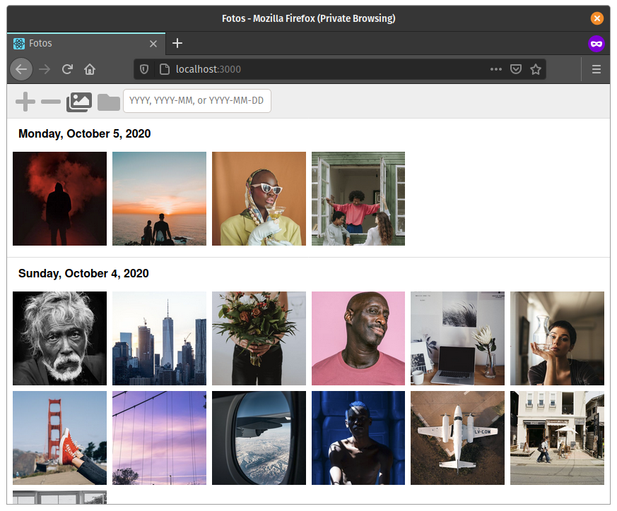

# fotos

A lightweight photo viewer inspired by iCloud Photos.



## Dependencies

1.  NodeJS 10
1.  Yarn
1.  Docker (optional)

Easily install the correct versions using [asdf](https://asdf-vm.com) by running `$ asdf install`

## Getting started

### Bare metal

1.  Install dependencies
1.  Start the backend in one terminal
    1.  `$ cd backend`
    1.  `$ source .envrc.template`
    1.  `$ yarn start`
1.  Start the frontend in another terminal
    1.  `$ cd fronend`
    1.  `$ yarn start`
    1.  Open [fotos](http://localhost:3000) in a web browser

### With Docker

1.  Build image locally `$ docker build -t fotos .`
1.  Start container locally
    ```
    $ docker run \
        -p 3000:3000 \
        -v $(pwd)/fixtures/photos:/photos:ro \
        -v $(pwd)/fixtures/albums:/albums:ro \
        --rm \
        fotos
    ```
1.  Open [fotos](http://localhost:3000/) in a web browser

## Deploying

Some example deployments with Docker can be found in `./examples`.

## Attributions

Fixture photos were downloaded from [Pexels](https://www.pexels.com).
